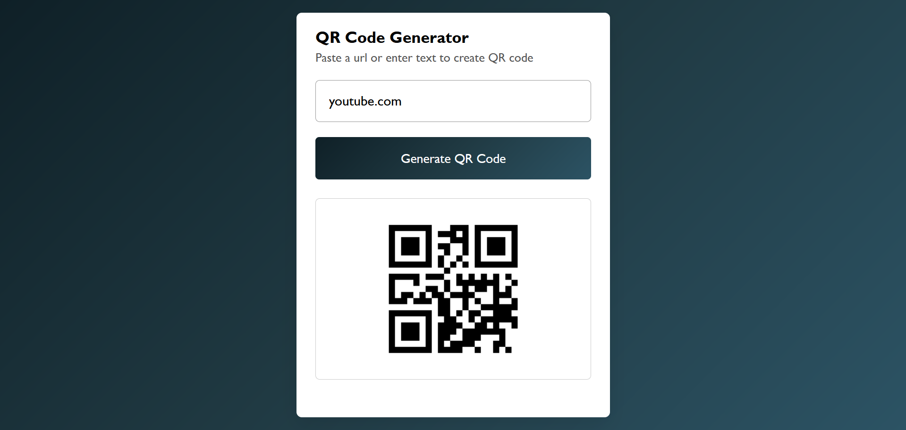

# 🔳 QR Code Generator

A clean, responsive, and easy-to-use **QR Code Generator** built using HTML, CSS, and JavaScript.  
It allows users to instantly generate QR codes for any text or URL with a modern UI.

---

## 📌 Description

The QR Code Generator lets users enter text or URLs and instantly converts them into scannable QR codes using an external API.  
It features a minimal design, smooth animations, and real-time QR rendering without page reloads.

This project is ideal for beginners who want hands-on practice with DOM manipulation, API integration, and responsive UI design.

---

## 🛠 Tech Stack

  
  
  

---

## ✨ Features

🔹 Generate QR codes instantly
🔹 Supports both text and URLs
🔹 Clean and modern user interface
🔹 Smooth height animation on QR generation
🔹 Responsive design for all screen sizes
🔹 Uses external QR Code API
🔹 No page refresh required

---

## 📸 Screenshots

### 🔹 Initial Screen

### 🔹 Generated QR Code

---

## 👤 Author

**Utkarsh Kashid**  
First-Year Computer Engineering Student  

---

## 🤝 Feel Free to Contribute

Feel free to fork this project, suggest improvements, add new features, or enhance the UI.  
Contributions are always welcome! 🚀
